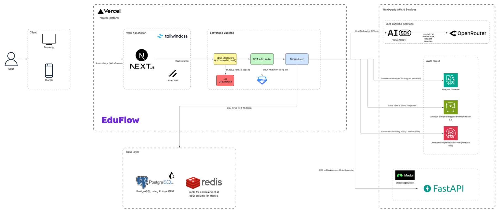

<div align="center">
  
</div>

<div align="center">
  <p><strong>An AI-powered education workspace for turning course materials into interactive learning experiences.</strong></p>
  <p>Reduce repetitive teaching work. Give every learner personalized, inquiry-led support.</p>
  <p><strong>Built by reLearn · RMIT SSET Capstone 2026</strong></p>

  <p>
    <a href="https://www.rmitvn-showcase.com/relearn"><strong>🎓 Explore EduFlow at the RMIT SSET Capstone 2026 Showcase</strong></a>
  </p>

  <p>
    
    
    
    
    
  </p>
</div>

## 🌟 The problem EduFlow tackles

Educators spend valuable time creating lessons, assessments, feedback, and learning materials across disconnected tools. At the same time, students often need more timely, personalized support than a teacher can sustainably provide to every learner.

EduFlow brings those workflows into one AI-integrated educational ecosystem. Its **teacher augmentation** approach helps educators turn existing course materials into lessons, presentations, quizzes, assignments, and interactive activities while keeping them in control of the final content. For students, focused AI assistants provide guided, context-aware help that encourages active learning rather than simply supplying answers.

## ✨ Product highlights

### For educators

- **Course and member management** — organize modules and lessons, invite students and teachers, configure course roles, and track grades and learning activity.
- **AI-assisted lesson authoring** — generate lesson drafts from course context, refine them in a rich-text editor, and enrich learning material with media and interactive content.
- **Presentation generation** — plan and generate template-based slide decks, edit slide content, render previews, and export presentations to PPTX.
- **Assessment workflows** — build question banks and quizzes, configure delivery and feedback modes, review attempts, and manage assignment submissions and results.
- **AI-assisted feedback** — analyze assignment submissions, produce feedback drafts, and keep grading and publication decisions with the educator.
- **Live game quizzes** — generate and edit classroom games, host real-time sessions, and review participant results after play.

### For students

- **Socratic Tutor** — supports problem solving through progressive questions and guided hints instead of answer-first tutoring.
- **Study Assistant** — explores course topics, creates practice quizzes and interactive activities, and can ground responses in selected lesson material.
- **Writing Assistant** — helps draft, revise, paraphrase, and improve written communication through a persistent chat workspace.
- **English Assistant** — combines translation, grammar analysis, text-to-speech, pronunciation assessment, IPA-aware vocabulary tools, and a personal word bank.
- **Connected learning** — access lessons, complete quizzes and assignments, join live games, review feedback, and revisit shared AI resources.

### Platform foundation

- **Grounded AI with citations** — course files and lesson content can be processed into searchable references so AI responses can point learners back to their source material.
- **Bilingual experience** — the application supports both English and Vietnamese interfaces.
- **Role-aware access** — platform and course permissions distinguish administrators, course owners, teachers, and students.
- **Content and file workflows** — upload course resources directly to S3-compatible storage, organize them in an inventory, and import or export supported content through Google Drive.
- **Shareable resources** — publish controlled links to AI conversations and interactive study content.

## 🧠 How it works

<div align="center">
  
</div>

EduFlow is delivered as a responsive **Next.js** web application on **Vercel**, with Tailwind CSS and shadcn/ui providing the interface across desktop and mobile devices. Requests pass through authentication-aware edge middleware before reaching validated API route handlers and the service layer, keeping access control, request validation, and business logic clearly separated.

The service layer reads and writes application data through **Prisma and PostgreSQL**, while **Redis** supports caching and guest chat data. External capabilities are integrated behind the backend boundary: the **Vercel AI SDK** connects EduFlow to language models through OpenRouter, AWS services provide translation, object storage, and authentication email delivery, and a **FastAPI** service deployed on Modal handles document conversion and slide-generation workloads.

## 🛠️ Technology

| Area | Tools | Role in EduFlow |
| --- | --- | --- |
| Web experience | Next.js 16, React 19, TypeScript, Tailwind CSS, shadcn/ui | Localized, responsive educator and student interfaces |
| AI and retrieval | Vercel AI SDK, Google AI, OpenRouter, Tavily | Streaming assistants, structured generation, grounded research, and citations |
| Content creation | Tiptap, custom slide services, PPTX export | Editable lessons, interactive content, and presentation workflows |
| Data and storage | Prisma, PostgreSQL with pgvector, S3/MinIO, Redis/SRH | Relational data, course resources, retrieval metadata, caching, and rate limits |
| Identity and integrations | Better Auth, Google Drive APIs, AWS Translate | Authentication, permissions, cloud file workflows, and translation support |
| Real-time learning | PartyKit | Hosted classroom game sessions and live scoring |
| Quality and contracts | Vitest, Testing Library, Zod, Biome, Swagger | Behavioral tests, request validation, code quality, and API documentation |

## 🚀 Local development

### Prerequisites

- [Git](https://git-scm.com/)
- [Docker](https://docs.docker.com/get-docker/) with Docker Compose
- [Bun 1.4.2](https://bun.sh/docs/installation)

### 1. Clone and install

```bash
git clone https://github.com/Initiative-Hub/eduflow.git
cd eduflow
bun install
```

### 2. Configure the environment

Copy both example environment files before starting the local service stack:

```bash
cp .env.example .env.local
cp external-services/.env.example external-services/.env
```

On PowerShell, use `Copy-Item` instead of `cp` if aliases are disabled.

Replace the placeholder values for the capabilities you intend to use. The examples group configuration for:

- PostgreSQL, Better Auth, S3/MinIO, Redis/SRH, and live-game secrets
- Google AI, OpenRouter, the AI Gateway, and Tavily search
- Google OAuth and Drive, AWS Translate, email, and Merriam-Webster dictionary services
- The separate presentation and rendering service in `external-services/`

Never commit either environment file or any provider credentials.

### 3. Start services and initialize the database

```bash
bun start:all
bun db:migrate
bun db:seed
```

The Docker Compose stack starts PostgreSQL, Mailpit, MinIO, Redis, SRH, and the supporting presentation service. PostgreSQL is exposed on port **5433** locally.

### 4. Run EduFlow

```bash
bun dev
```

Open [http://localhost:3000](http://localhost:3000). For local live-game WebSocket support, run the PartyKit development server in a second terminal:

```bash
bun ws:dev
```

### Local service reference

| Service | URL or address |
| --- | --- |
| EduFlow | [http://localhost:3000](http://localhost:3000) |
| PostgreSQL | `localhost:5433` |
| Mailpit | [http://localhost:8025](http://localhost:8025) |
| MinIO API | [http://localhost:9000](http://localhost:9000) |
| MinIO console | [http://localhost:9001](http://localhost:9001) |
| SRH Redis HTTP proxy | [http://localhost:8079](http://localhost:8079) |
| Presentation service | [http://localhost:8000](http://localhost:8000) |
| PartyKit development server | [http://localhost:1999](http://localhost:1999) |

Useful project checks:

```bash
bun test
bun type-check
bun lint
```

API documentation is available at `/api-docs` while the application is running.

## 🎓 Capstone and team

EduFlow is a substantial educational technology product created by **reLearn** for the **RMIT School of Science, Engineering & Technology Capstone Showcase 2026 (Sep 17th, 2026)**. The project explores how carefully integrated AI can reduce repetitive educator workload while making personalized, critical-thinking-based learning support more accessible.

### 👥 Meet reLearn

| Team member | GitHub profile |
| --- | --- |
| Nguyen Gia Khang | [@khangronky](https://github.com/khangronky) |
| Huynh Tan Phat | [@phatgg221](https://github.com/phatgg221) |
| Ngo Van Tai | [@TaiVanNgo](https://github.com/TaiVanNgo) |
| Nguyen Pham Anh Thu | [@thu-ngx](https://github.com/thu-ngx) |

Learn more about the project, its motivation, and its capstone presentation on the **[official RMIT showcase page](https://www.rmitvn-showcase.com/relearn)**.
